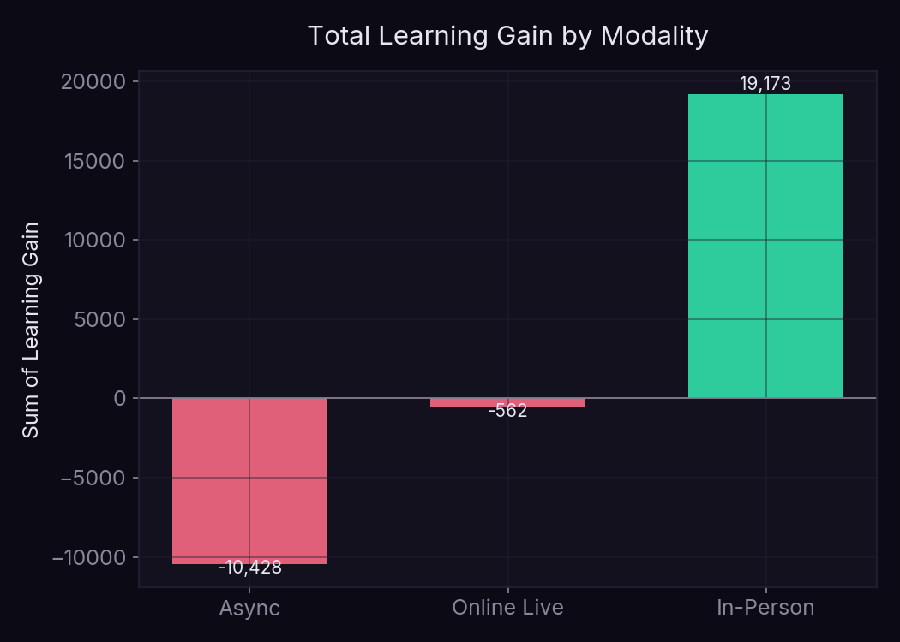
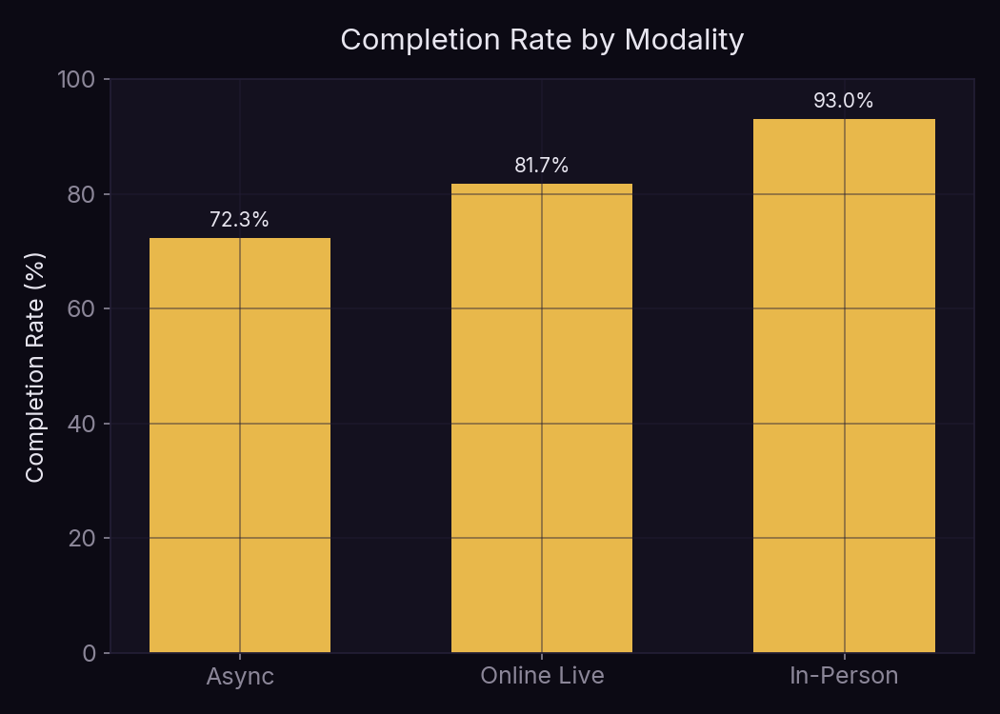
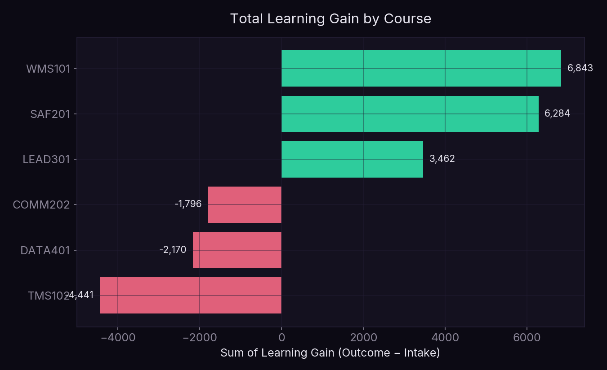
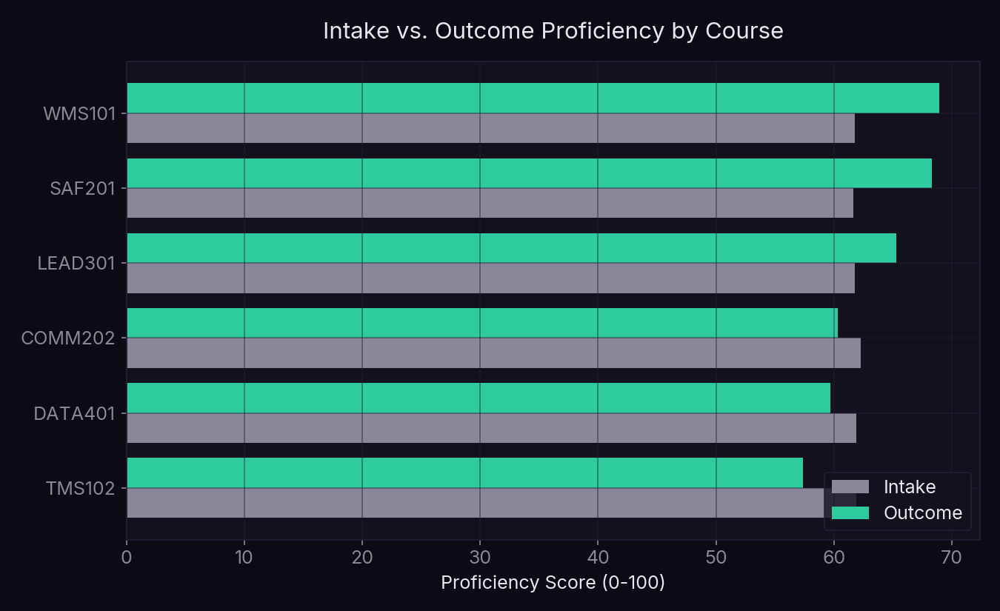
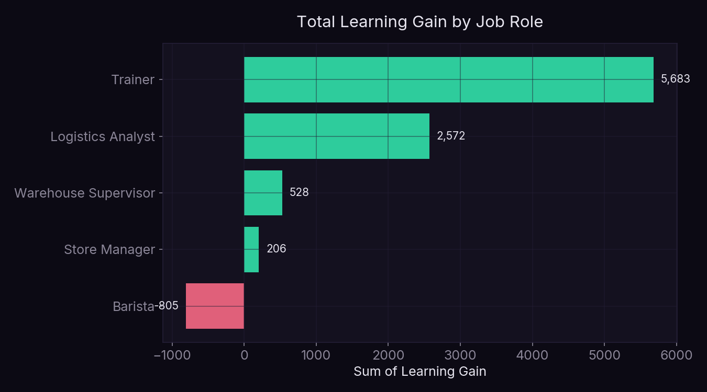
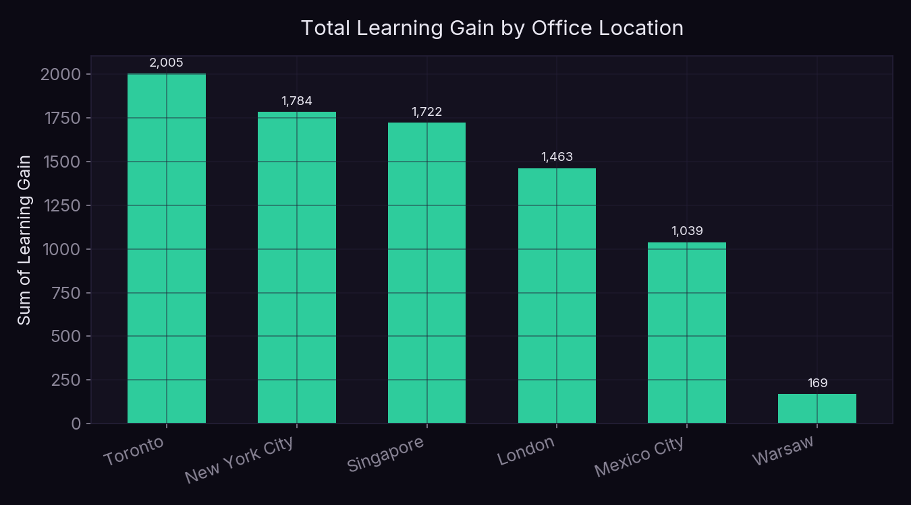

[README (1).md](https://github.com/user-attachments/files/30326157/README.1.md)
<div align="center">



[](https://www.python.org/)
[](https://pandas.pydata.org/)
[](https://matplotlib.org/)

</div>

# Quantifying Training ROI Across Delivery Formats and Job Roles

> Which employees, courses, and learning formats actually drive skill gains, and where is the training investment paying off?

**Collaborative analytics project** — contributed as part of a project team, working from a real client brief for a corporate learning and development function.

---

## Business Context

A coffee company's internal Learning Academy runs employee training across six courses (warehouse systems, transportation management, safety, leadership, customer experience, and data analytics) delivered in three formats: in-person, online live, and self-paced async modules.

The client had no standardized way to measure whether the Academy was actually working. Enrollment numbers existed, but there was no clear picture of which courses, formats, roles, or locations were converting training time into real skill improvement. This analysis builds those metrics from raw enrollment records and turns them into a set of concrete recommendations on where to invest further.

**Core question:** How is the workforce engaging with Learning Academy programs across courses, formats, roles, and locations, and where should the company focus its training resources?

---

## Dataset

Four linked tables, joined on employee, course, and location IDs:

| Table | Rows | Contents |
|---|---|---|
| Employee data | 6,000 | Role, tenure, location, and country per employee |
| Enrollment data | 5,789 | Course taken, modality, dates, completion flag, intake and outcome proficiency scores |
| Course catalog | 6 | Course name, duration, credits, available modalities |
| Regional data | 6 | Office location details for each of the six global hubs |

Enrollment records span January 2023 through December 2024, across six offices: London, Toronto, New York City, Mexico City, Warsaw, and Singapore.

### Data Cleaning Notes

- The `Status` field in the enrollment data contains five values, four of them undocumented codes (`DNL`, `EXT`, `PPE`, `PPD`) alongside a large share of missing values. None of these appeared in the data dictionary provided, and none showed a meaningful relationship to completion rate on inspection, so `Status` was treated as an internal tracking field rather than an analysis dimension.
- No duplicate enrollment records were found.
- Intake and outcome proficiency scores had no missing values across all 5,789 enrollments, so no imputation was needed.
- `Learning Gain` was calculated for every enrollment as `Outcome_Proficiency − Intake_Proficiency`, since this wasn't a field in the original data.

---

## Key Findings

### Overall Program Health

Across all 5,789 enrollments: an 83.9% completion rate, average intake proficiency of 61.9, average outcome proficiency of 63.3, and an average learning gain of +1.4 points. On its own, that average gain looks modest, but it hides a sharp split once you break it down by course and by format.

### Format Is the Strongest Driver of Learning Gain

In-person training produced a total learning gain of roughly +8,600 points across all enrollments and a 93% completion rate — the strongest result in the dataset on both measures. Online live sessions landed in the middle, with completion around 82% and a small negative net gain. Async, self-paced modules performed worst on both axes: 72% completion and a total learning gain of about −7,700, meaning outcome scores on average came in *below* intake scores for employees who took courses this way.




### Two Courses Carry the Program, Three Are a Net Drag

WMS101 (Warehouse Management Systems) and SAF201 (Safety & Compliance) are the standout performers, with average learning gains of +7.2 and +6.7 points and completion rates above 89%. At the other end, DATA401 (Data Analytics for Operations) and TMS102 (Transportation Management Systems) show *negative* average gains — outcome scores that are lower, on average, than intake scores for people who completed them.





This isn't necessarily a sign the courses are poorly designed. DATA401 and TMS102 are also the two courses offered exclusively through Online Live and Async formats, with no in-person option — so the format effect and the course effect are tangled together here rather than fully separable with the data available.

### Trainers Get the Most Out of the Program, Baristas Get the Least

Employees in the Trainer role show the highest total learning gain (roughly +5,700) and an 88% completion rate. Baristas are the only role with a *negative* total learning gain (about −800) and the lowest completion rate at 80%. Warehouse Supervisors and Store Managers land in between, both close to flat on net learning gain despite solid completion rates.



### Toronto and New York Lead, Warsaw Lags

By total learning gain, Toronto (+2,005) and New York City (+1,784) lead the six offices, followed by Singapore and London. Warsaw trails well behind the rest at +169 total gain despite a completion rate in line with every other office (83%) — the gap here is in proficiency improvement, not participation.



---

## Business Recommendations

**1. Investigate async and online live delivery for DATA401 and TMS102 specifically.** These two courses combine the weakest learning outcomes with delivery formats that show weaker outcomes platform-wide. Piloting an in-person or hybrid version of one of these courses would help isolate whether the problem is the course content or the delivery format.

**2. Treat in-person training as the benchmark format, not just one option among three.** The completion and learning gain gap between in-person and async is large enough that async should be reserved for lower-stakes or refresher content, not primary skill-building courses.

**3. Look into what's different about the Barista training experience.** Baristas show the lowest completion and only negative net learning gain among all job roles. Given the format finding above, it's worth checking whether Baristas are disproportionately enrolled in async courses due to scheduling constraints on the café floor.

**4. Audit the Warsaw office's training conditions.** Completion rates are normal, but proficiency gains lag every other location significantly. This looks like a delivery or support-quality issue specific to that office rather than a participation problem.

---

## Limitations

- The `Status` field's undocumented values (`DNL`, `EXT`, `PPE`, `PPD`) could reasonably hold information relevant to this analysis (e.g. flags for extensions or partial completions) but were excluded because their meaning wasn't documented anywhere in the materials provided.
- Course and modality are confounded for DATA401 and TMS102, since neither is offered in-person. The negative learning gain for those two courses can't be fully separated from the negative effect associated with their delivery formats.
- The dataset covers a two-year window (2023–2024); trends over time within that window were not analyzed here but could reveal whether performance is improving or declining.
- Tenure, pay grade, and supervisor data exist in the employee table but weren't incorporated into this analysis; role and location were prioritized based on the client's stated questions.

---

## Tools & Technologies

| Category | Tools |
|---|---|
| Data Wrangling | Python, pandas |
| Visualization | matplotlib |
| Analysis | Descriptive statistics, groupby aggregation across course/modality/role/location dimensions |

---

## Project Structure

```
tnla-learning-analytics/
│
├── banner.png
├── data/
│   ├── tnla_course_data.csv
│   ├── tnla_employee_data_student.csv
│   ├── tnla_enrollment_data.csv
│   └── tnla_regional_data.csv
├── scripts/
│   └── generate_charts.py
├── images/
│   └── [chart images]
└── README.md
```

---

## About

A collaborative analytics project, built with a project team.

Tanya Patel is an MS Business Analytics Candidate at Simon Business School, University of Rochester (December 2026).

[LinkedIn](https://www.linkedin.com/in/tanyapatel23/) | [Email](mailto:tpatel18@simon.rochester.edu)
